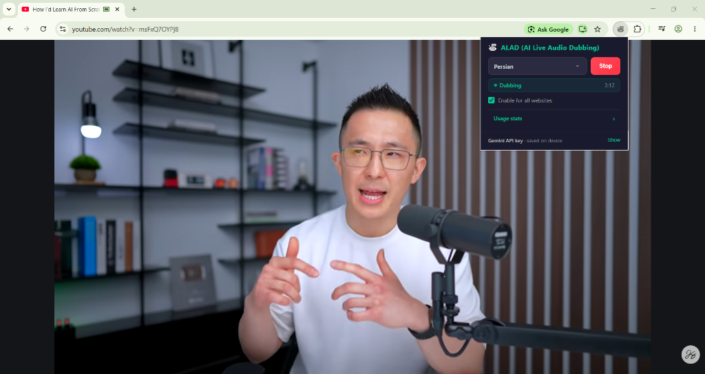
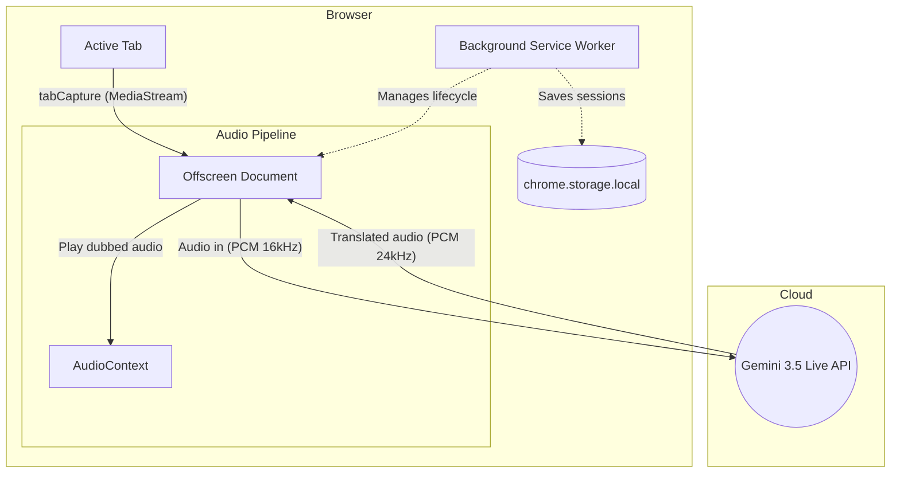

<div align="center">
  🌐 <a href="README.md">Read in English</a> | <strong>خواندن به زبان فارسی</strong>
</div>

<div align="center">


<h1>🎙️ ALAD — دوبله زنده صوتی با هوش مصنوعی</h1>

<p><strong>دوبله زنده و بلادرنگ با هوش مصنوعی برای تمام تب‌های کروم، با قدرت گوگل Gemini 3.5 Live.</strong></p>

<p>
  <a href="https://github.com/navidseyedain/ALAD/stargazers"></a>
  
  
  
  
</p>

<p>
  <b dir="rtl">هر ویدیویی را تماشا کنید. آن را فوراً به زبان خودتان بشنوید.</b><br/>
  بدون نیاز به اشتراک. بدون نیاز به ساخت اکانت. ۱۰۰٪ رایگان و اوپن‌سورس.
</p>

<br/>



<br/><br/>

</div>

---

## 🎬 عملکرد افزونه را ببینید

<!-- TODO: Drag and drop demo.mp4 here in the GitHub Web Editor -->

---

<div dir="rtl">

## 🌍 ALAD چیست؟

**ALAD (AI Live Audio Dubbing)** یک افزونه کروم رایگان و اوپن‌سورس است که سد زبانی را برای هر محتوایی که آنلاین تماشا می‌کنید، می‌شکند. این افزونه در پس‌زمینه بی‌صدا کار می‌کند — صدای تب فعال شما را ضبط می‌کند، آن را از طریق یک اتصال پایدار WebSocket به پیشرفته‌ترین مدل گوگل یعنی **Gemini 3.5 Live Translate** می‌فرستد و صدای ترجمه‌شده را به صورت بلادرنگ پخش می‌کند.

برخلاف ابزارهای سنتی تولید زیرنویس، ALAD **دوبله صوتی و گفتاری زنده** تولید می‌کند — شما ترجمه را *می‌شنوید*، نه اینکه فقط آن را بخوانید.

> **مثال‌هایی از کاربردها:**
> - 🎬 تماشای یک سریال کره‌ای بدون زیرنویس و شنیدن آن به زبان انگلیسی یا فارسی
> - 📰 گوش دادن به یک پادکست خبری آلمانی که زنده به عربی دوبله می‌شود
> - 🎓 دنبال کردن یک سخنرانی ژاپنی به زبان فارسی به صورت بلادرنگ
> - 🎮 تماشای استریمرهای خارجی در توییچ و فهمیدن تمام حرف‌هایشان

---

## ✨ امکانات

### 🎙️ هسته اصلی: دوبله زنده با هوش مصنوعی
- **استریم دوطرفه بلادرنگ (Real-time)** از طریق WebSocket به Gemini API — با کمترین تأخیر ممکن
- **بی‌صدا کردن خودکار** صدای اصلی تب هنگام شروع دوبله و بازگرداندن آن هنگام توقف
- **بافر هوشمند صدا** — صف‌بندی تکه‌های صوتی دریافت‌شده قبل از تکمیل هندشیک WebSocket، بنابراین هرگز کلمات اول را از دست نمی‌دهید
- **بازیابی نشست (Session resumption)** که در پروتکل تعبیه شده است برای اتصال مجدد بدون قطعی
- روی **یوتیوب، توییچ، ویمیو، نتفلیکس، پادکست‌ها، وبینارها** و دقیقاً هر تبی که صدا پخش کند کار می‌کند

### 🌐 سازگاری جهانی با تمام تب‌ها
محدود به یوتیوب نیست. اگر تب مرورگر صدا پخش کند — **ALAD می‌تواند آن را دوبله کند**.

### 🗺️ پشتیبانی از ۷۸ زبان
(شامل فارسی، انگلیسی، اسپانیایی، فرانسوی، آلمانی، ترکی، عربی، کره‌ای، ژاپنی و...)

### 📊 داشبورد پیشرفته آمار استفاده
یک صفحه کامل آنالیز — که **۱۰۰٪ به صورت لوکال (محلی)** روی دستگاه خودتان ذخیره می‌شود.

</div>

<div align="center">

</div>

<div dir="rtl">

- **هیت‌مپ (Heatmap) فعالیت مشابه گیت‌هاب** — مشاهده تاریخچه ۳۶۴ روزه دوبله‌های شما در یک نگاه
- **نمودار الگوی شنیداری ۲۴ ساعته** — کشف ساعات اوج استفاده شما از افزونه
- **برترین زبان‌ها و دامنه‌ها** — ببینید چه محتوایی را بیشتر دوبله کرده‌اید
- **فیلترهای زمانی هوشمند** — ۷ روز، ۳۰ روز، ۹۰ روز یا کل تاریخچه
- ذخیره تا **۲۰۰۰ نشست (Session)** به صورت لوکال و بدون انقضا

### 🎨 رابط کاربری تیره و زیبا

</div>

<div align="center">

&nbsp;&nbsp;&nbsp;

</div>

<br/>

<div dir="rtl">

- پاپ‌آپ **تم تاریک (Dark-themed)** و جذاب که حس یک برنامه نیتیو را در کروم می‌دهد
- **انتخاب‌گر زبان اختصاصی** با اسکرول نرم و اسکرول‌بار طراحی‌شده
- **تایمر زنده نشست** هنگام فعال بودن دوبله

</div>

<div align="center">

</div>

<div dir="rtl">

### 🔒 حریم خصوصی اولویت ماست
- **بدون ردیابی، بدون تله‌متری** — تمام داده‌های نشست‌ها روی سیستم شما باقی می‌ماند
- **مدل BYOK (کلید خودتان را بیاورید)** — شما از کلید رایگان Gemini API خودتان استفاده می‌کنید
- **بدون نیاز به حساب کاربری** — نه ثبت‌نامی، نه لاگینی و نه اشتراکی در کار است

---

## 🛠️ آموزش نصب (حالت Developer)

> ⚠️ افزونه ALAD هنوز در Chrome Web Store منتشر نشده است. برای نصب دستی مراحل زیر را دنبال کنید:

۱. **این ریپازیتوری را دانلود یا کلون کنید:**
   ```bash
   git clone https://github.com/navidseyedain/ALAD.git
   ```
۲. مرورگر کروم را باز کرده و به آدرس `chrome://extensions/` بروید.
۳. گزینه **Developer mode** را (در گوشه بالا سمت راست) فعال کنید.
۴. روی دکمه **Load unpacked** کلیک کنید.
۵. پوشه پروژه `ALAD` را انتخاب کنید.
۶. ✅ آیکون ALAD در نوار ابزار شما ظاهر می‌شود — برای دسترسی راحت‌تر آن را **پین (Pin)** کنید.

---

## ⚡ شروع سریع

### مرحله ۱ — دریافت کلید API رایگان
افزونه ALAD از Gemini API استفاده می‌کند. برای دریافت کلید رایگان خود:

۱. به **[Google AI Studio](https://aistudio.google.com/app/apikey)** بروید.
۲. با اکانت گوگل خود وارد شوید.
۳. روی **"Create API Key"** کلیک کرده و کلید تولید شده را کپی کنید.

> 💡 محدودیت طرح رایگان گوگل بسیار سخاوتمندانه است و برای استفاده روزمره شخصی کاملاً کافی است.

### مرحله ۲ — پیکربندی ALAD
۱. روی آیکون ALAD در نوار ابزار کروم کلیک کنید.
۲. در پایین پاپ‌آپ، کنار عبارت *Gemini API key* روی **"Show"** کلیک کنید.
۳. کلید خود را جای‌گذاری (Paste) کرده و روی **Save** کلیک کنید.

### مرحله ۳ — شروع دوبله
۱. به هر تبی که در حال پخش صداست بروید (مثل یوتیوب، پادکست و...).
۲. زبان مقصد خود را از لیست انتخاب کنید (مثلاً Persian).
۳. روی **"Start dubbing"** کلیک کنید.
۴. صدای اصلی بی‌صدا می‌شود — و هوش مصنوعی کنترل را به دست می‌گیرد! 🎙️

### مرحله ۴ — توقف
روی **"Stop dubbing"** کلیک کنید تا صدای اصلی ویدیو بازگردد. اطلاعات این نشست به طور خودکار در بخش آمارهای شما ذخیره می‌شود.

---

## 🧠 این افزونه چگونه کار می‌کند؟



| بخش | تکنولوژی | هدف |
|-----------|-----------|---------|
| **ضبط صدا** | `chrome.tabCapture` + Offscreen Document | ضبط استریم صوتی هر تب مرورگر |
| **مدل هوش مصنوعی** | `gemini-3.5-live-translate-preview` | ترجمه و تبدیل گفتار دوطرفه به صورت بلادرنگ |
| **پروتکل ارتباطی** | WebSocket (`BidiGenerateContent`) | استریم بی‌وقفه با کمترین تأخیر |
| **پخش صدا** | Web Speech API / AudioContext | پخش صدای دوبله‌شده برای کاربر |
| **ردیابی نشست‌ها** | `chrome.storage.local` | ذخیره تا ۲۰۰۰ نشست به صورت محلی |
| **همگام‌سازی تنظیمات** | `chrome.storage.sync` | ذخیره کلید API و زبان انتخابی در اکانت مرورگر |

---

## 📁 ساختار پروژه

```text
ALAD/
├── manifest.json          # مانیفست افزونه کروم (نسخه ۳)
├── icons/
│   ├── icon.png           # آیکون افزونه (رنگی)
│   └── iconw.png          # آیکون افزونه (پس‌زمینه شفاف/سفید)
├── popup/
│   ├── popup.html         # رابط کاربری پاپ‌آپ افزونه
│   ├── popup.css          # استایل‌های تم تاریک پاپ‌آپ
│   └── popup.js           # منطق پاپ‌آپ، لیست ۷۸ زبان، تایمر نشست
├── scripts/
│   ├── background.js      # سرویس ورکر: چرخه حیات دوبله و ذخیره نشست‌ها
│   ├── offscreen.html     # فایل میزبان (Host) داکیومنت آف‌اسکرین
│   ├── offscreen.js       # ضبط صدا + پل ارتباطی وب‌سوکت با جمنای
│   └── content.js         # اسکریپت محتوا: بی‌صدا و صدادار کردن پلیر تب
├── services/
│   └── gemini.js          # کلاینت وب‌سوکت جمنای
├── stats/
│   ├── index.html         # داشبورد آمار استفاده
│   ├── style.css          # استایل‌های داشبورد (هیت‌مپ، نمودارها، تم تاریک)
│   └── script.js          # منطق داشبورد (رندر نمودارها، فیلترها)
└── docs/                  # اسکرین‌شات‌ها برای فایل README
```

---

## 🔧 عیب‌یابی (Troubleshooting)

| مشکل | راه‌حل |
|---------|----------|
| **صدا بعد از شروع پخش نمی‌شود** | مطمئن شوید که تب در حال پخش صداست. بررسی کنید کلید API شما معتبر باشد و سهمیه آن تمام نشده باشد. |
| **خطای "WebSocket connection failed"** | ممکن است کلید API شما اشتباه باشد. سعی کنید یک کلید جدید در [AI Studio](https://aistudio.google.com/app/apikey) بسازید. |
| **داشبورد آمار خالی است** | نشست‌ها تنها زمانی ثبت می‌شوند که دوبله را متوقف (Stop) کنید (حداقل باید ۳ ثانیه طول بکشد). یک نشست کوتاه انجام دهید و صفحه آمار را رفرش کنید. |
| **صدای اصلی ویدیو بی‌صدا (Mute) نمی‌شود** | برخی از پلیرهای وب اجازه بی‌صدا کردن با جاوا اسکریپت را نمی‌دهند. صفحه را رفرش کنید و دوباره امتحان کنید. |
| **آیکون افزونه نمایش داده نمی‌شود** | افزونه را در تب `chrome://extensions/` ری‌لود (Reload) کنید تا کش آیکون پاک شود. |

---

## 🗺️ نقشه راه (Roadmap)

- [ ] انتشار در Chrome Web Store
- [ ] تشخیص خودکار زبان (شناسایی زبان مبدأ به صورت اتوماتیک)
- [ ] کلیدهای میانبر شخصی‌سازی شده برای شروع/توقف دوبله
- [ ] اکسپورت (خروجی گرفتن) آمارها به فرمت CSV
- [ ] پشتیبانی از انتخاب صدای طبیعی برای هر زبان به صورت مجزا

---

## 🤝 مشارکت

از هرگونه مشارکت، گزارش باگ یا پیشنهاد قابلیت جدید استقبال می‌شود!

۱. ریپازیتوری را فورک (Fork) کنید.
۲. برنچ فیچر خود را بسازید: `git checkout -b feature/AmazingFeature`
۳. تغییرات را کامیت کنید: `git commit -m 'feat: add AmazingFeature'`
۴. تغییرات را روی گیت‌هاب خود پوش کنید: `git push origin feature/AmazingFeature`
۵. یک Pull Request باز کنید.

---

## 📜 لایسنس

این پروژه تحت لایسنس **MIT** منتشر شده است. برای اطلاعات بیشتر فایل `LICENSE` را ببینید.

---

## 🙏 تشکر و قدردانی

- از **[Google DeepMind](https://deepmind.google/)** برای توسعه مدل فوق‌العاده Gemini 3.5 Live Translate.
- از **[Google AI Studio](https://aistudio.google.com/)** برای ارائه دسترسی رایگان به API.

---

<div align="center">
  <p>اگر ALAD شما را حتی برای یک ویدیو از خواندن زیرنویس‌ها نجات داد — با دادن یک ⭐ از ما حمایت کنید!</p>
  <strong>ساخته شده با ❤️ برای تمام زبان‌آموزان، جهانگردان و ذهن‌های کنجکاو در سراسر دنیا.</strong>
</div>

</div>
