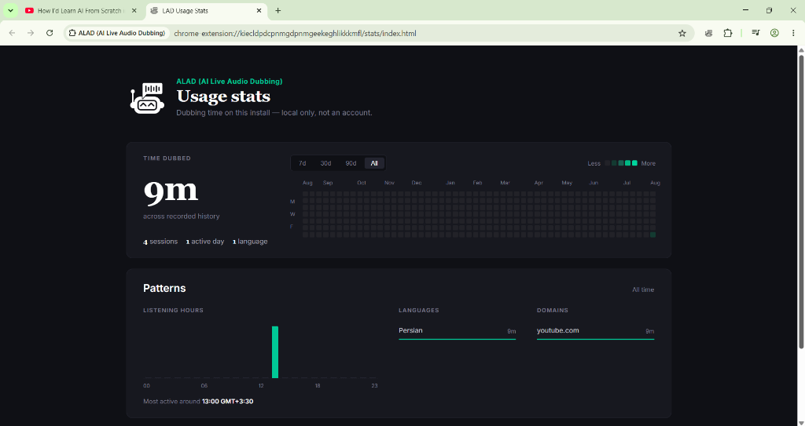
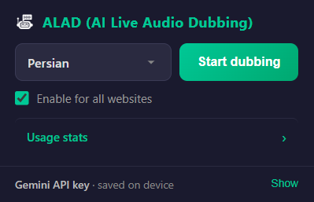
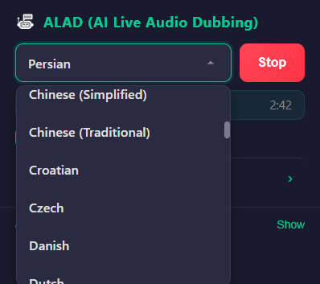
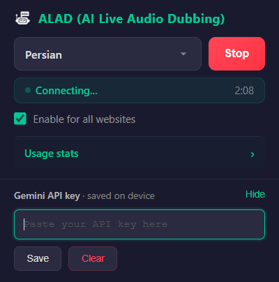

<div align="center">


<h1>🎙️ ALAD — AI Live Audio Dubbing</h1>

<p><strong>Real-time AI voice dubbing for any Chrome tab, powered by Google's Gemini 3.5 Live Translate.</strong></p>

<p>
  <a href="https://github.com/navidseyedain/ALAD/stargazers"></a>
  
  
  
  
</p>

<p>
  <b>Watch any video. Hear it in your language — instantly.</b><br/>
  No subscriptions. No accounts. 100% free and open-source.
</p>

<br/>

<video src="https://github.com/navidseyedain/ALAD/raw/main/docs/demo.mp4" controls="controls" muted="muted" style="max-width: 100%; width: 800px;"></video><br/><br/>

</div>

---

## 🌍 What is ALAD?

**ALAD (AI Live Audio Dubbing)** is a free, open-source Chrome extension that breaks the language barrier for any content you consume online. It works silently in the background — capturing the audio from your active tab, sending it to Google's cutting-edge **Gemini 3.5 Live Translate** model over a persistent WebSocket connection, and playing back the translated voice in real-time.

Unlike traditional captioning or subtitle tools, ALAD produces **live spoken audio dubbing** — you *hear* the translation, not just read it.

> **Use case examples:**
> - 🎬 Watch a Korean drama without subtitles and hear it in English
> - 📰 Listen to a German news podcast dubbed live in Arabic  
> - 🎓 Follow a Japanese lecture in Persian in real-time  
> - 🎮 Watch foreign streamers on Twitch and understand every word

---

## ✨ Features

### 🎙️ Core: Live AI Dubbing
- **Real-time bidirectional streaming** via WebSocket to the Gemini API — ultra-low latency
- **Auto-mutes** the original tab audio when dubbing starts, and restores it on stop
- **Smart audio buffering** — queues audio chunks received before WebSocket handshake, so you never miss the first words
- **Session resumption** built into the protocol for seamless reconnects
- Works on **YouTube, Twitch, Vimeo, Netflix, podcasts, webinars** and literally any tab playing audio

### 🌐 Universal Tab Compatibility
Not limited to YouTube. If the tab plays audio — **ALAD can dub it**.

### 🗺️ 78 Languages Supported

| | | | |
|---|---|---|---|
| 🇿🇦 Afrikaans | 🇪🇹 Amharic | 🇸🇦 Arabic | 🇦🇲 Armenian |
| 🇦🇿 Azerbaijani | 🇧🇩 Bengali | 🇧🇬 Bulgarian | 🇲🇲 Burmese |
| 🇨🇳 Chinese (Simplified) | 🇹🇼 Chinese (Traditional) | 🇭🇷 Croatian | 🇨🇿 Czech |
| 🇩🇰 Danish | 🇳🇱 Dutch | 🇺🇸 English | 🇪🇪 Estonian |
| 🇵🇭 Filipino | 🇫🇮 Finnish | 🇫🇷 French | 🇬🇪 Georgian |
| 🇩🇪 German | 🇬🇷 Greek | 🇮🇳 Gujarati | 🇳🇬 Hausa |
| 🇮🇱 Hebrew | 🇮🇳 Hindi | 🇭🇺 Hungarian | 🇮🇸 Icelandic |
| 🇮🇩 Indonesian | 🇮🇹 Italian | 🇯🇵 Japanese | 🇮🇳 Kannada |
| 🇰🇿 Kazakh | 🇰🇭 Khmer | 🇷🇼 Kinyarwanda | 🇰🇷 Korean |
| 🇱🇦 Lao | 🇱🇻 Latvian | 🇱🇹 Lithuanian | 🇲🇰 Macedonian |
| 🇲🇾 Malay | 🇮🇳 Malayalam | 🇮🇳 Marathi | 🇲🇳 Mongolian |
| 🇳🇵 Nepali | 🇳🇴 Norwegian | 🇮🇷 Persian | 🇵🇱 Polish |
| 🇧🇷 Portuguese (Brazil) | 🇵🇹 Portuguese (Portugal) | 🇮🇳 Punjabi | 🇷🇴 Romanian |
| 🇷🇺 Russian | 🇷🇸 Serbian | 🇮🇳 Sindhi | 🇱🇰 Sinhala |
| 🇸🇰 Slovak | 🇸🇮 Slovenian | 🇪🇸 Spanish | 🇰🇪 Swahili |
| 🇸🇪 Swedish | 🇮🇳 Tamil | 🇮🇳 Telugu | 🇹🇭 Thai |
| 🇹🇷 Turkish | 🇺🇦 Ukrainian | 🇵🇰 Urdu | 🇺🇿 Uzbek |
| 🇻🇳 Vietnamese | 🇿🇦 Zulu | | |

### 📊 Advanced Usage Stats Dashboard
A full analytics page — stored **100% locally** on your device.

<div align="center">

</div>

- **GitHub-style Activity Heatmap** — 364 days of dubbing history at a glance
- **24-hour Listening Pattern Chart** — discover your peak dubbing hours
- **Top Languages & Domains** — see what content you dub the most
- **Smart time filters** — 7d, 30d, 90d, or all time
- Stores up to **2,000 sessions** locally with no expiry

### 🎨 Beautiful Dark UI

<div align="center">

&nbsp;&nbsp;&nbsp;

</div>

<br/>

- Sleek **dark-themed** popup that feels native to Chrome
- **Custom-built language selector** with smooth scroll and styled scrollbar
- Live **session timer** while dubbing is active

<div align="center">

</div>

### 🔒 Privacy First
- **Zero tracking, zero telemetry** — all session data stays on your machine
- **BYOK (Bring Your Own Key)** — you use your own free Gemini API key
- **No account required** — no sign-up, no login, no subscription

---

## 🛠️ Installation (Developer Mode)

> ⚠️ ALAD is not yet on the Chrome Web Store. Follow these steps to install it manually.

1. **Download or clone this repository:**
   ```bash
   git clone https://github.com/navidseyedain/ALAD.git
   ```
2. Open Chrome and navigate to `chrome://extensions/`
3. Enable **Developer mode** (toggle in the top-right corner)
4. Click **Load unpacked**
5. Select the `ALAD` project folder
6. ✅ The ALAD icon will appear in your toolbar — **pin it** for easy access

---

## ⚡ Quick Start

### Step 1 — Get a Free API Key
ALAD uses the Gemini API. Get your free key:

1. Go to **[Google AI Studio](https://aistudio.google.com/app/apikey)**
2. Sign in with your Google account
3. Click **"Create API Key"** → copy it

> 💡 The free tier is generous and more than enough for personal daily use.

### Step 2 — Configure ALAD
1. Click the ALAD icon in your Chrome toolbar
2. Click **"Show"** next to *Gemini API key* at the bottom
3. Paste your key and click **Save**

### Step 3 — Start Dubbing
1. Navigate to any tab with audio (YouTube, podcast, etc.)
2. Select your target language from the dropdown
3. Click **"Start dubbing"**
4. The original audio mutes — the AI takes over 🎙️

### Step 4 — Stop
Click **"Stop dubbing"** to restore original audio. The session is automatically saved to your stats.

---

## 🧠 How It Works

```
┌─────────────────────────────────────────────────────────────┐
│                     ALAD Architecture                       │
├─────────────────────────────────────────────────────────────┤
│                                                             │
│  [Active Tab]                                               │
│       │  tabCapture API (MediaStream)                       │
│       ▼                                                     │
│  [Offscreen Document]                                       │
│       │  PCM 16kHz chunks (Base64)                          │
│       │                                                     │
│       ├──► [WebSocket: Gemini 3.5 Live Translate]           │
│       │         ▲ Audio in (PCM 16kHz)                      │
│       │         ▼ Translated audio out (PCM 24kHz)          │
│       │                                                     │
│  [AudioContext]  ◄── Decode & play dubbed audio             │
│                                                             │
│  [Background Service Worker]                                │
│       ├── Manages session lifecycle & status                │
│       └── Persists stats → chrome.storage.local             │
│                                                             │
└─────────────────────────────────────────────────────────────┘
```

| Component | Technology | Purpose |
|-----------|-----------|---------|
| **Audio Capture** | `chrome.tabCapture` + Offscreen Document | Captures any tab's audio stream |
| **AI Model** | `gemini-3.5-live-translate-preview` | Real-time bidirectional speech translation |
| **Protocol** | WebSocket (`BidiGenerateContent`) | Persistent low-latency streaming |
| **Playback** | Web Speech API / AudioContext | Plays dubbed audio to the user |
| **Session Tracking** | `chrome.storage.local` | Stores up to 2,000 sessions locally |
| **Settings Sync** | `chrome.storage.sync` | Syncs API key & language preference |

---

## 📁 Project Structure

```
ALAD/
├── manifest.json          # Chrome Extension manifest (MV3)
├── icons/
│   ├── icon.png           # Extension icon (color)
│   └── iconw.png          # Extension icon (white/transparent bg)
├── popup/
│   ├── popup.html         # Extension popup UI
│   ├── popup.css          # Dark-themed popup styles
│   └── popup.js           # Popup logic, 78-language list, session timer
├── scripts/
│   ├── background.js      # Service worker: dubbing lifecycle & session tracking
│   ├── offscreen.html     # Offscreen document host
│   ├── offscreen.js       # Audio capture + Gemini WebSocket bridge
│   └── content.js         # Content script: mutes/unmutes tab video element
├── services/
│   └── gemini.js          # Gemini WebSocket client (BidiGenerateContent)
├── stats/
│   ├── index.html         # Usage stats dashboard
│   ├── style.css          # Dashboard styles (heatmap, charts, dark theme)
│   └── script.js          # Dashboard logic (heatmap render, hourly chart, filters)
└── docs/                  # Screenshots for README
```

---

## 🔧 Troubleshooting

| Problem | Solution |
|---------|----------|
| **No audio output after starting** | Ensure the tab is playing audio. Check your API key is valid and has quota remaining. |
| **"WebSocket connection failed"** | Your API key may be incorrect. Try regenerating it at [AI Studio](https://aistudio.google.com/app/apikey). |
| **Stats dashboard is empty** | Sessions are recorded only after you stop dubbing (min. 3 seconds). Do a quick session and refresh the stats page. |
| **Original audio not muting** | Some embedded players block JS muting. Refresh the page and try again. |
| **Extension icon shows placeholder** | Reload the extension from `chrome://extensions/` to clear the icon cache. |

---

## 🗺️ Roadmap

- [ ] Chrome Web Store release
- [ ] Language auto-detection (detect source language automatically)
- [ ] Custom keyboard shortcuts to start/stop dubbing
- [ ] Export usage stats as CSV
- [ ] Support for natural per-language voice selection

---

## 🤝 Contributing

Contributions, issues and feature requests are welcome!

1. Fork the repository
2. Create your feature branch: `git checkout -b feature/AmazingFeature`
3. Commit your changes: `git commit -m 'feat: add AmazingFeature'`
4. Push to the branch: `git push origin feature/AmazingFeature`
5. Open a Pull Request

---

## 📜 License

Distributed under the **MIT License**. See `LICENSE` for more information.

---

## 🙏 Acknowledgments

- **[Google DeepMind](https://deepmind.google/)** for the Gemini 3.5 Live Translate model
- **[Google AI Studio](https://aistudio.google.com/)** for providing free API access

---

<div align="center">
  <p>If ALAD saved you from reading subtitles for even one video — give it a ⭐</p>
  <strong>Made with ❤️ for language learners, travelers, and curious minds everywhere.</strong>
</div>
